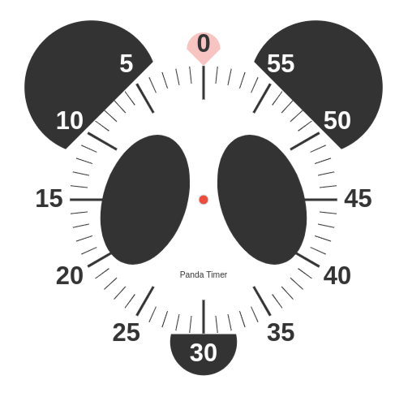

<h1 align="center">
    Panda Timer
</h1>

<p align="center">
    
</p>

This javascript widget was created for needs of the [Association Panda Thérèse-de Blainville et des Laurentides](https://translate.google.com/translate?sl=fr&tl=en&u=pandatdb.com) in order to contribute to the promotion of its services to the population by making this usefull tool available.

**Panda** stands for ***P**ersonne **A**pte à **N**égocier avec le **D**éficit d’**A**ttention* in French, which can be translated to *Person Able to Negotiate with Attention Deficit Disorder*.

> Note that if you find this widget useful, consider supporting your local ADHD organization.

## Features

- It's a javascript countdown widget;
- It emits a single quiet beep every 55, 50, 45, 45 ... remaining minutes;
- It emits two loud beeps when there is no more time;
- It's fully configurable;
- It just works.

## Quick start

Just copy the `dist / panda-timer.min.js` file somewhere on your website, then add this `HTML` code to your webpage:

```html
<canvas id="panda-timer" height="500" width="500"></canvas>
<script src="panda-timer.min.js"></script>
<script>
  new PandaTimer();
</script>
```

## API

```javascript
// Configurable parameters, see below.
const config = {};

// Get the canvas element to paint on, by default it searches for 'canvas#panda-timer' if not specified.
const canvasElement = document.getElementById('panda-timer');

// Instanciate a new Panda Timer.
const pandaTimer = new PandaTimer(canvasElement, config);
```

```javascript
// Set the remaining time in seconds without starting the timer.
pandaTimer.setTimeLeft(300);
```

```javascript
// Start the timer without setting the remaining time.
pandaTimer.start();

// Start the timer at 300 seconds.
pandaTimer.start(300);
```

```javascript
// Pause the timer.
pandaTimer.stop();
```

```javascript
// Subscribe to the timer and call the callback function when 300 seconds left.
const subscription = pandaTimer.subscribe((timeLeft) => console.log(timeLeft), 300);

// Unsubscribe from the timer subscription.
subscription.unsubscribe();
```

```javascript
// Get the remaining time in seconds.
console.log(pandaTimer.timeLeft);
```

## Default configuration

```javascript
{
    alterable: true,                      // Allow users to change the remaining
                                          // time by rotating the cursor around
                                          // the clock face.
    autostart: true,                      // Start the timer immediately or not.
    color: {
        background: '#fff',               // Background color of the canvas.
        cursor: 'rgba(255, 51, 51, 0.3)', // Color of the cursor.
        face: '#fff',                     // Color of the rounded face.
        panda: '#333',                    // Panda color.
        scale: '#333',                    // Scale color.
        text: '#333',                     // Text line color.
        timer: '#f33',                    // Timer color.
    },
    font: 'arial',                        // Text font.
    indexed: true,                        // Move cursor aligned with marks.
    reminders: true,                      // Emit reminder beeps every slice
                                          // of 5 minutes.
    text: {
        line1: 'Panda Timer',             // First text line.
        line1: '',                        // Second text line.
    },
    timeLeft: 0,                          // Start with the time remaining in seconds.
    timeMax: 3600,                        // Maximum timer time in seconds.
}
```

## Show your appreciation / Support the author

If you like [Panda Timer](https://github.com/chuot/panda-timer) please consider **starring the repository** to show you appreciation to the author for his hard work. It cost nothing but is really appreciated.

If you use [Panda Timer](https://github.com/chuot/panda-timer) for commercial purposes or derive income from it, please consider [sponsoring this project](https://github.com/sponsors/chuot) to help support continued development.
